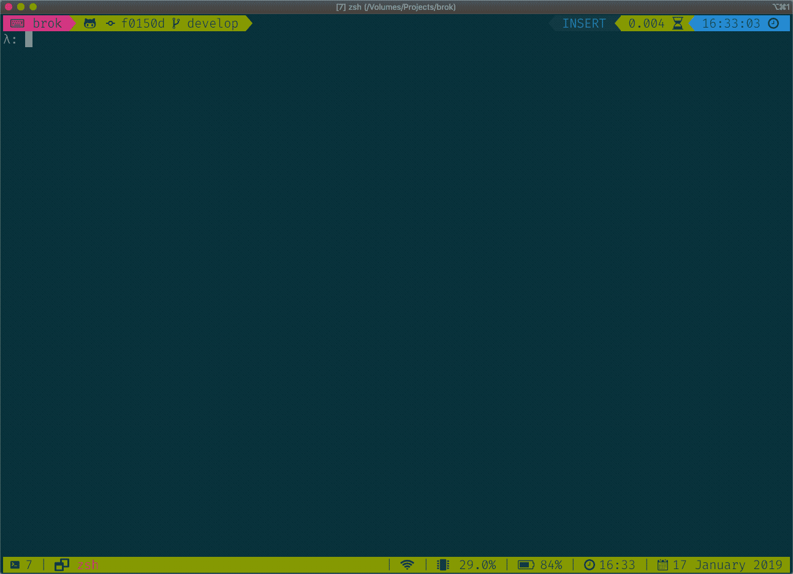

# brök

Find broken links in text documents



Similar idea to [awesome_bot](https://github.com/dkhamsing/awesome_bot), but with different output options.

Currently only supports `http://` and `https://` prefixed URLs

## Install

[Binaries for Mac and Linux are available](https://github.com/smallhadroncollider/brok/releases). Add the binary to a directory in your path (such as `/usr/local/bin`).

### Docker

To build the latest version:

```bash
docker build -t brok https://github.com/smallhadroncollider/brok.git
```

To run brök:

```bash
docker run brok
```


### Cabal

If you have `cabal` installed:

```bash
cabal install brok
```

Make sure you run `cabal update` if you haven't run it recently.

### Building

**Requirements**: [Stack](https://docs.haskellstack.org/en/stable/README/)

The following command will build brök and then install it in `~/.local/bin`:

```bash
stack build && stack install
```

## Usage

### Basic Usage

Check all links in a single text file:

```bash
brok test.md
```

Or in multiple files:

```bash
brok test.md links.tex
```

If you're using this as part of a test suite, you probably only need the errors:

```
brok text.md links.tex > /dev/null
```

### Options

#### Cache

By default brök will cache successes for a day in a `.brokdb` file. It will always recheck errors.

If you want to adjust the cache length, you can enter the number of seconds after which the cache invalidates:

```bash
# cache for a week
brok --cache 604800 test.md links.tex
```

If you want to avoid creating the `.brokdb` file or ignore the cache entirely you can use the `--no-cache` option:

```bash
# do not cache results
# and don't use previously generated cache
brok --no-cache test.md links.tex
```

#### Check Certificates

Most browsers will display a website even if it has certificate issues (such as an incomplete certificate chain). By default Brök will not check certificates, so replicate this behaviour.

If you would like to enforce certificate checking, you can turn this on:

```bash
brok --check-certs test.md
```

Any sites with certificate issues will then return a `Could not connect` error.

#### Ignore URLs

You can tell brök to ignore URLs with specified prefixes:

```bash
# ignore facebook and amazon URLS
brok --ignore "http://facebook.com" "http://amazon.com" test.md links.tex
```

#### Interval

By default brök waits for 100ms between URL checks. You can change the delay:

```bash
# wait for 1 second between checks
brok --interval 1000 test.md links.tex
```

#### Only Show Failures

If you want to see what's going on, but you're not interested in successes, then you can use the `--only-failures` option:

```bash
# see what's going on, but only show failures
brok --only-failures test.md links.tex
```

If you're using brök as part of a script then you should [redirect `stdout`](#basic-usage).

### Colour Output

By default the output uses bash colour codes. You can turn this off using the `--no-color` setting.


### Git Pre-Commit Hook

If you want to check all the links in your Git repo are valid before being able to commit then add something like the following to `.git/hooks/pre-commit`.

#### `bash`

```bash
#! /bin/bash

# cache for 1 week
# use find to check all *.md files
# only show errors (if there are any)
brok --cache 604800 $(find . -type f -name "*.md") > /dev/null
```

#### `zsh`

```bash
#! /bin/zsh

# cache for 1 week
# using a zsh glob to check all *.md files
# only show errors (if there are any)
brok --cache 604800 */**/*.md > /dev/null
```
